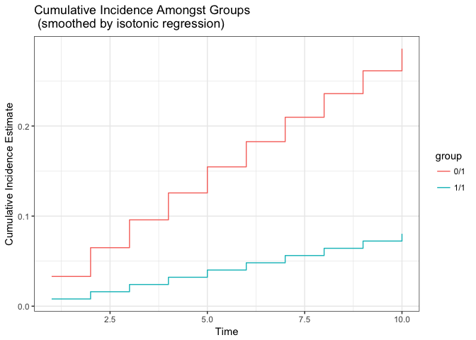

<!-- README.md is generated from README.Rmd. Please edit that file -->
R/`survtmle`
============

[](https://travis-ci.org/benkeser/survtmle) [](https://ci.appveyor.com/project/benkeser/survtmle) [](https://codecov.io/github/benkeser/survtmle?branch=master) [](http://www.r-pkg.org/pkg/survtmle) [](https://CRAN.R-project.org/package=survtmle) [](http://www.repostatus.org/#active) [](http://opensource.org/licenses/MIT) [](https://doi.org/10.5281/zenodo.835868)

> Targeted Minimum Loss-Based Estimation (TMLE) for Survival Analysis with Competing Risks

**Authors:** [David Benkeser](https://www.benkeserstatistics.com/) and [Nima Hejazi](http://nimahejazi.org)

------------------------------------------------------------------------

Description
-----------

`survtmle` is an R package designed to use targeted minimum loss-based estimation (TMLE) to compute covariate-adjusted marginal cumulative incidence estimates in right-censored survival settings with and without competing risks. The estimates can leverage ensemble machine learning via the `SuperLearner` package.

------------------------------------------------------------------------

Installation
------------

For standard use, we recommend installing the package from [CRAN](https://cran.r-project.org/) via

``` r
install.packages("survtmle")
```

You can install a stable release of `survtmle` from GitHub via [`devtools`](https://www.rstudio.com/products/rpackages/devtools/) with:

``` r
devtools::install_github("benkeser/survtmle")
```

<!--
To contribute, install the _development version_ from GitHub via
[`devtools`](https://www.rstudio.com/products/rpackages/devtools/):


```r
devtools::install_github("benkeser/survtmle", ref = "develop")
```
-->

------------------------------------------------------------------------

Issues
------

If you encounter any bugs or have any specific feature requests, please [file an issue](https://github.com/benkeser/survtmle/issues).

------------------------------------------------------------------------

Example
-------

This minimal example shows how to use `survtmle` to obtain cumulative incidence estimates with a very simple, simulated data set.

``` r
# simulate data
set.seed(341796)
n <- 100
t_0 <- 10
W <- data.frame(W1 = runif(n), W2 = rbinom(n, 1, 0.5))
A <- rbinom(n, 1, 0.5)
T <- rgeom(n,plogis(-4 + W$W1 * W$W2 - A)) + 1
C <- rgeom(n, plogis(-6 + W$W1)) + 1
ftime <- pmin(T, C)
ftype <- as.numeric(ftime == T)

# load the package
library(survtmle)
#> survtmle: Targeted Learning for Survival Analysis
#> Version: 1.0.2.1

# apply survtmle for estimation
fit <- survtmle(ftime = ftime, ftype = ftype,
                trt = A, adjustVars = W,
                glm.trt = "1",
                glm.ftime = "I(W1*W2) + trt + t",
                glm.ctime = "W1 + t", method = "hazard",
                t0 = t_0)

# extract cumulative incidence at each timepoint
tpfit <- timepoints(fit, times = seq_len(t_0))

# examine output object produced by the timepoints function
tpfit
#> $est
#>              t1         t2         t3         t4         t5         t6
#> 0 1 0.032997470 0.06492788 0.09582530 0.12572293 0.15465313 0.18264737
#> 1 1 0.008014555 0.01603567 0.02406256 0.03209448 0.04013064 0.04817027
#>             t7         t8         t9        t10
#> 0 1 0.20973629 0.23594966 0.26131640 0.28586459
#> 1 1 0.05621257 0.06425675 0.07230203 0.08034761
#> 
#> $var
#>               t1           t2           t3           t4           t5
#> 0 1 4.565496e-04 0.0005099637 0.0004951975 0.0004852183 0.0005862762
#> 1 1 2.111604e-06 0.0003345475 0.0003208485 0.0003079889 0.0006317931
#>               t6           t7           t8           t9         t10
#> 0 1 0.0012883360 0.0013743743 0.0012847990 0.0020298371 0.003137739
#> 1 1 0.0006229943 0.0009761833 0.0009544762 0.0009534062 0.000956650

# examine plot of cumulative incidences
plot(tpfit)
```



------------------------------------------------------------------------

Contributions
-------------

Contributions are very welcome. Interested contributors can consult our [`contribution guidelines`](https://github.com/benkeser/survtmle/blob/master/CONTRIBUTING.md) prior to submitting a pull request.

------------------------------------------------------------------------

Citation
--------

After using the `survtmle` R package, please cite both of the following:

        @misc{benkeser2017survtmle,
          author = {Benkeser, David C and Hejazi, Nima S},
          title = {{survtmle}: Targeted Minimum Loss-Based Estimation for
                   Survival Analysis in {R}},
          year  = {2017},
          howpublished = {\url{https://github.com/benkeser/survtmle}},
          url = {http://dx.doi.org/10.5281/zenodo.835868},
          doi = {10.5281/zenodo.835868}
        }

        @article{benkeser2017improved,
          author = {Benkeser, David C and Carone, Marco and Gilbert, Peter B},
          title = {Improved estimation of the cumulative incidence of rare
                   outcomes},
          journal = {Statistics in Medicine},
          publisher = {Wiley-Blackwell},
          year  = {2017},
          doi = {10.1002/sim.7337}
        }

------------------------------------------------------------------------

License
-------

© 2016-2017 [David C. Benkeser](http://www.benkeserstatistics.com)

The contents of this repository are distributed under the MIT license. See below for details:

    The MIT License (MIT)

    Copyright (c) 2016-2017 David C. Benkeser

    Permission is hereby granted, free of charge, to any person obtaining a copy
    of this software and associated documentation files (the "Software"), to deal
    in the Software without restriction, including without limitation the rights
    to use, copy, modify, merge, publish, distribute, sublicense, and/or sell
    copies of the Software, and to permit persons to whom the Software is
    furnished to do so, subject to the following conditions:

    The above copyright notice and this permission notice shall be included in all
    copies or substantial portions of the Software.

    THE SOFTWARE IS PROVIDED "AS IS", WITHOUT WARRANTY OF ANY KIND, EXPRESS OR
    IMPLIED, INCLUDING BUT NOT LIMITED TO THE WARRANTIES OF MERCHANTABILITY,
    FITNESS FOR A PARTICULAR PURPOSE AND NONINFRINGEMENT. IN NO EVENT SHALL THE
    AUTHORS OR COPYRIGHT HOLDERS BE LIABLE FOR ANY CLAIM, DAMAGES OR OTHER
    LIABILITY, WHETHER IN AN ACTION OF CONTRACT, TORT OR OTHERWISE, ARISING FROM,
    OUT OF OR IN CONNECTION WITH THE SOFTWARE OR THE USE OR OTHER DEALINGS IN THE
    SOFTWARE.
